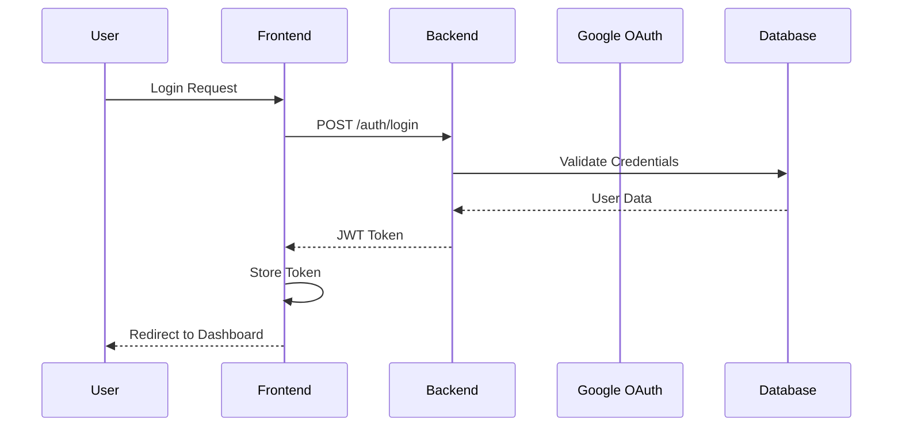
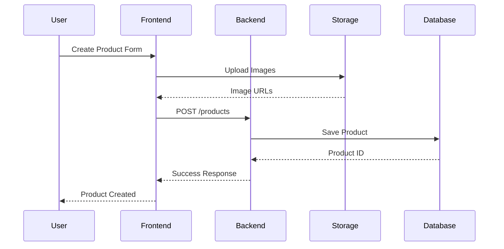
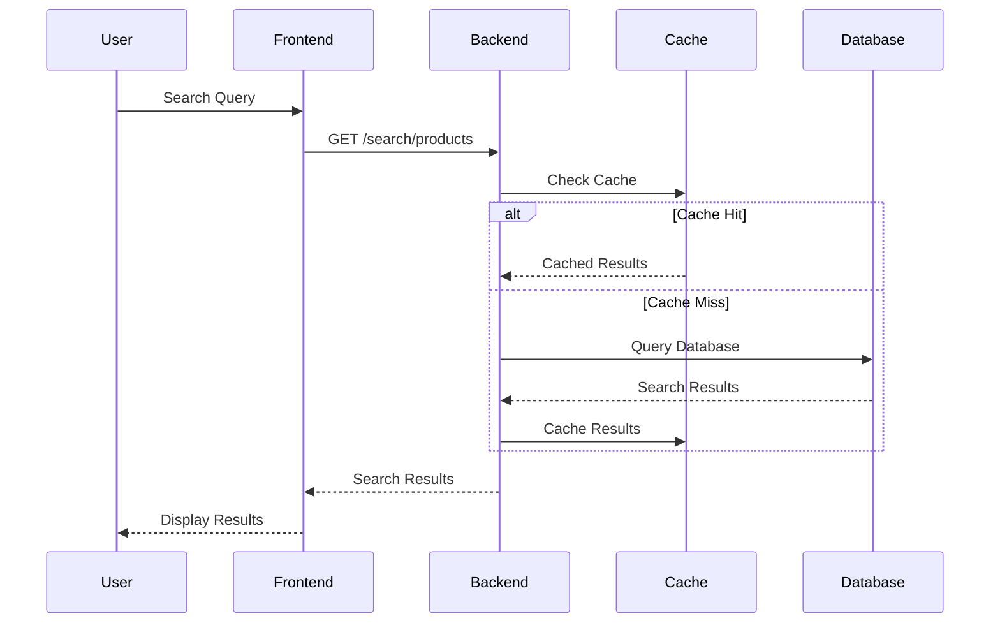
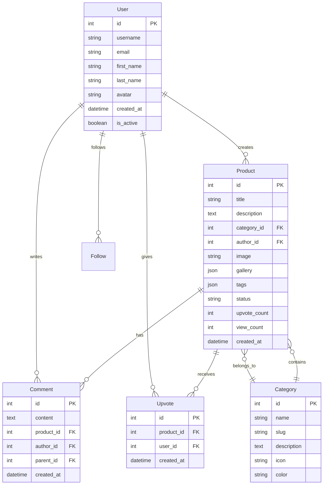

# System Architecture

This document describes the high-level architecture of the Vitrin platform.

## 🏗️ **Architecture Overview**

Vitrin follows a modern microservices-inspired architecture with clear separation of concerns:

```
┌─────────────────────────────────────────────────────────────┐
│                        Client Layer                         │
├─────────────────────────────────────────────────────────────┤
│  Web App (React)  │  Mobile App  │  Third-party Integrations │
└─────────────────────────────────────────────────────────────┘
                                │
                                ▼
┌─────────────────────────────────────────────────────────────┐
│                      API Gateway Layer                      │
├─────────────────────────────────────────────────────────────┤
│              Nginx Reverse Proxy & Load Balancer            │
└─────────────────────────────────────────────────────────────┘
                                │
                                ▼
┌─────────────────────────────────────────────────────────────┐
│                    Application Layer                        │
├─────────────────────────────────────────────────────────────┤
│  Frontend (Vite)  │  Backend API (Django)  │  Shared Libs   │
└─────────────────────────────────────────────────────────────┘
                                │
                                ▼
┌─────────────────────────────────────────────────────────────┐
│                      Service Layer                          │
├─────────────────────────────────────────────────────────────┤
│  Auth Service  │  Product Service  │  User Service  │  ...   │
└─────────────────────────────────────────────────────────────┘
                                │
                                ▼
┌─────────────────────────────────────────────────────────────┐
│                      Data Layer                             │
├─────────────────────────────────────────────────────────────┤
│  PostgreSQL  │  Redis Cache  │  File Storage  │  Search     │
└─────────────────────────────────────────────────────────────┘
```

## 🧩 **Component Architecture**

### Frontend (React + TypeScript)

```
src/
├── components/          # UI Components
│   ├── ui/             # Reusable UI components
│   ├── forms/          # Form components
│   └── pages/          # Page components
├── services/           # API Services
│   ├── api.ts         # HTTP client
│   ├── auth.ts        # Authentication service
│   └── products.ts    # Product service
├── hooks/              # Custom React hooks
├── utils/              # Utility functions
├── types/              # TypeScript definitions
└── config/             # Configuration
```

**Key Features:**
- Component-based architecture
- TypeScript for type safety
- React Query for data fetching
- Context API for state management
- Tailwind CSS for styling

### Backend (Django + Python)

```
backend/
├── core/               # Core Django app
├── products/           # Product management
├── users/              # User management
├── categories/         # Category management
├── comments/           # Comment system
├── vitrin/             # Django project settings
└── utils/              # Utility functions
```

**Key Features:**
- Django REST Framework
- JWT authentication
- Google OAuth integration
- Celery for background tasks
- PostgreSQL database
- Redis for caching

### Infrastructure (Docker + Nginx)

```
infrastructure/
├── docker-compose.yml      # Development environment
├── docker-compose.prod.yml # Production environment
├── nginx/                  # Nginx configuration
├── scripts/                # Deployment scripts
└── monitoring/             # Monitoring setup
```

**Key Features:**
- Containerized deployment
- Nginx reverse proxy
- SSL termination
- Load balancing
- Health checks

## 🔄 **Data Flow**

### 1. User Authentication Flow



### 2. Product Creation Flow



### 3. Search Flow



## 🗄️ **Database Architecture**

### Entity Relationship Diagram



### Database Design Principles

1. **Normalization**: Proper database normalization to avoid redundancy
2. **Indexing**: Strategic indexing for performance optimization
3. **Constraints**: Foreign key constraints for data integrity
4. **Migrations**: Version-controlled database schema changes
5. **Backups**: Regular automated backups

## 🔐 **Security Architecture**

### Authentication & Authorization

```
┌─────────────────┐    ┌─────────────────┐    ┌─────────────────┐
│   Frontend      │    │   Backend       │    │   Database      │
│                 │    │                 │    │                 │
│ 1. Login Form   │───▶│ 2. Validate     │───▶│ 3. Check User   │
│                 │    │    Credentials  │    │    Credentials  │
│                 │    │                 │    │                 │
│ 4. Store JWT    │◀───│ 5. Generate JWT │◀───│ 6. Return User  │
│                 │    │    Token        │    │    Data         │
│                 │    │                 │    │                 │
│ 7. API Requests │───▶│ 8. Verify JWT   │    │                 │
│    with Token   │    │    Token        │    │                 │
└─────────────────┘    └─────────────────┘    └─────────────────┘
```

### Security Layers

1. **Network Security**
   - HTTPS/TLS encryption
   - Firewall rules
   - DDoS protection

2. **Application Security**
   - JWT token authentication
   - CORS configuration
   - Input validation and sanitization
   - SQL injection prevention

3. **Data Security**
   - Password hashing (bcrypt)
   - Sensitive data encryption
   - Database access controls
   - Regular security audits

## 📊 **Performance Architecture**

### Caching Strategy

```
┌─────────────────┐    ┌─────────────────┐    ┌─────────────────┐
│   Browser       │    │   CDN/Proxy     │    │   Application   │
│                 │    │                 │    │                 │
│ 1. Static Assets│    │ 2. API Responses│    │ 3. Database     │
│    Cache        │    │    Cache        │    │    Query Cache  │
│                 │    │                 │    │                 │
│ Cache-Control   │    │ Redis Cache     │    │ Query Optimization│
│ ETags           │    │ Memcached       │    │ Connection Pool │
└─────────────────┘    └─────────────────┘    └─────────────────┘
```

### Performance Optimizations

1. **Frontend**
   - Code splitting and lazy loading
   - Image optimization and compression
   - Bundle size optimization
   - Service worker for caching

2. **Backend**
   - Database query optimization
   - Redis caching
   - Connection pooling
   - Background task processing

3. **Infrastructure**
   - CDN for static assets
   - Load balancing
   - Auto-scaling
   - Database read replicas

## 🔄 **Deployment Architecture**

### Development Environment

```
┌─────────────────┐    ┌─────────────────┐    ┌─────────────────┐
│   Frontend      │    │   Backend       │    │   Database      │
│   (Vite Dev)    │    │   (Django)      │    │   (SQLite)      │
│   Port: 3000    │    │   Port: 8000    │    │   File-based    │
└─────────────────┘    └─────────────────┘    └─────────────────┘
```

### Production Environment

```
┌─────────────────┐    ┌─────────────────┐    ┌─────────────────┐
│   Load Balancer │    │   App Servers   │    │   Database      │
│   (Nginx)       │    │   (Docker)      │    │   (PostgreSQL)  │
│   Port: 80/443  │    │   Multiple      │    │   Master/Slave  │
└─────────────────┘    └─────────────────┘    └─────────────────┘
         │                       │                       │
         ▼                       ▼                       ▼
┌─────────────────┐    ┌─────────────────┐    ┌─────────────────┐
│   CDN           │    │   Redis Cache   │    │   File Storage  │
│   (Static Assets)│   │   (Sessions)    │    │   (S3/CloudFlare)│
└─────────────────┘    └─────────────────┘    └─────────────────┘
```

## 📈 **Scalability Considerations**

### Horizontal Scaling

1. **Application Layer**
   - Stateless application design
   - Load balancer distribution
   - Auto-scaling groups
   - Container orchestration (Kubernetes)

2. **Database Layer**
   - Read replicas for read-heavy workloads
   - Database sharding for large datasets
   - Connection pooling
   - Query optimization

3. **Caching Layer**
   - Redis cluster for high availability
   - CDN for global content delivery
   - Application-level caching
   - Database query caching

### Vertical Scaling

1. **Resource Optimization**
   - CPU and memory monitoring
   - Database performance tuning
   - Application profiling
   - Resource allocation optimization

## 🔍 **Monitoring & Observability**

### Monitoring Stack

```
┌─────────────────┐    ┌─────────────────┐    ┌─────────────────┐
│   Application   │    │   Infrastructure│    │   Business      │
│   Metrics       │    │   Metrics       │    │   Metrics       │
│                 │    │                 │    │                 │
│ • Response Time │    │ • CPU Usage     │    │ • User Activity │
│ • Error Rate    │    │ • Memory Usage  │    │ • Product Views │
│ • Throughput    │    │ • Disk Usage    │    │ • Conversion    │
│ • Database      │    │ • Network I/O   │    │ • Revenue       │
└─────────────────┘    └─────────────────┘    └─────────────────┘
         │                       │                       │
         └───────────────────────┼───────────────────────┘
                                 ▼
                    ┌─────────────────┐
                    │   Monitoring    │
                    │   Dashboard     │
                    │   (Grafana)     │
                    └─────────────────┘
```

### Logging Strategy

1. **Application Logs**
   - Structured logging (JSON)
   - Log levels (DEBUG, INFO, WARN, ERROR)
   - Request/response logging
   - Error tracking and alerting

2. **Infrastructure Logs**
   - System logs
   - Access logs
   - Security logs
   - Performance logs

## 🚀 **Future Architecture Considerations**

### Microservices Migration

As the platform grows, consider migrating to microservices:

```
┌─────────────────┐    ┌─────────────────┐    ┌─────────────────┐
│   API Gateway   │    │   Auth Service  │    │   Product       │
│   (Kong/Envoy)  │    │   (Dedicated)   │    │   Service       │
└─────────────────┘    └─────────────────┘    └─────────────────┘
         │                       │                       │
         ▼                       ▼                       ▼
┌─────────────────┐    ┌─────────────────┐    ┌─────────────────┐
│   User Service  │    │   Search        │    │   Notification  │
│                 │    │   Service       │    │   Service       │
└─────────────────┘    └─────────────────┘    └─────────────────┘
```

### Event-Driven Architecture

Implement event-driven patterns for better scalability:

- Message queues (RabbitMQ, Apache Kafka)
- Event sourcing
- CQRS (Command Query Responsibility Segregation)
- Saga patterns for distributed transactions

## 📚 **Additional Resources**

- [Database Schema](database-schema.md) - Detailed database design
- [API Design](api-design.md) - API architecture patterns
- [Security Architecture](security.md) - Security implementation
- [Deployment Guide](../guides/deployment.md) - Deployment strategies
- [Performance Guide](../guides/performance.md) - Performance optimization
